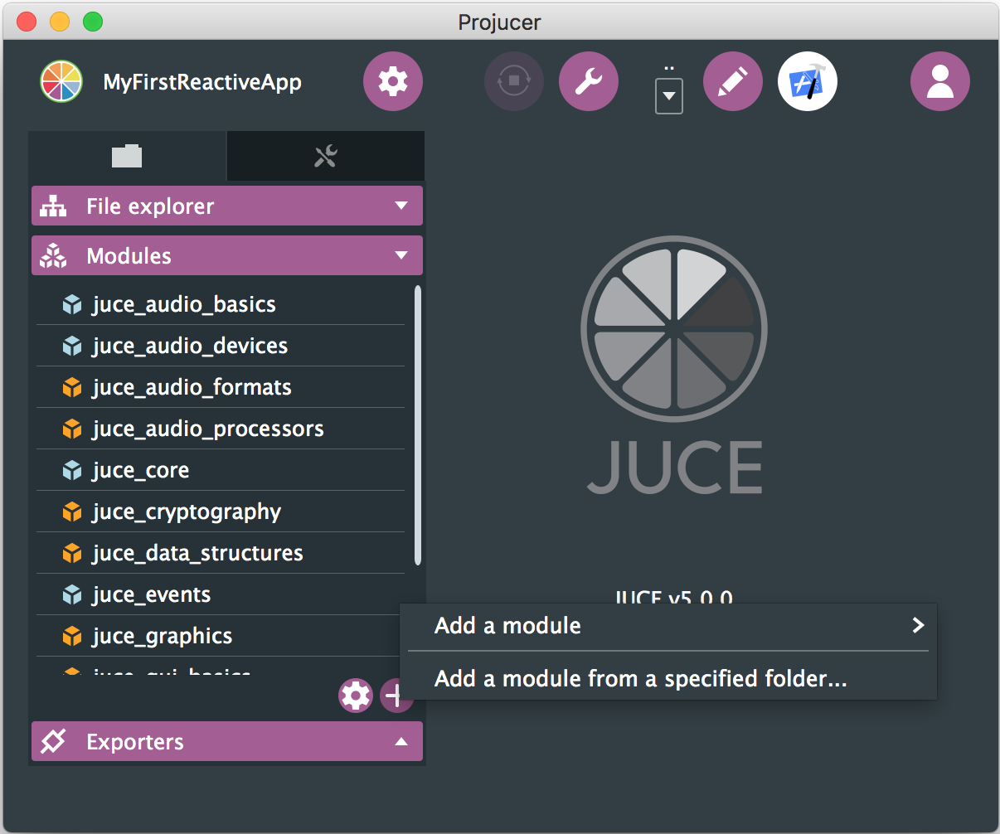
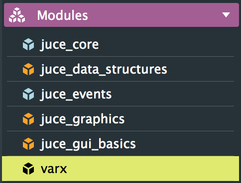

# varx - Reactive Extensions (Rx) for JUCE

varx brings [Reactive Extensions (Rx)](http://reactivex.io/intro.html) to [JUCE](https://www.juce.com). It helps to connect our app's user interface, parameters and audio processing in a simple, flexible and consistent way. It reduces boilerplate and prevents errors.

#### Table of Contents

1. [Why Use varx?](#why-use-varx)
2. [Installation](#installation)
3. [Getting Started](#getting-started)
4. [API Reference](#api-reference)
5. [Tests](#tests)
6. [Credits](#credits)
7. [License](#license)


<a name="why-use-varx"/>

## Why Use varx?

Let's see how varx can **reduce boilerplate code and errors** in our apps.

Say we have a distortion plug-in with a `Slider` for the distortion amount. We want to show this amount in words in a `Label`. This is our main `Component`:

```cpp
class MainComponent : public Component {
public:
  MainComponent() { /*call addAndMakeVisible(), etc. */ }

private:
  Slider distortionSlider;
  Label warmthLabel;
  
  static String textForDistortion(double distortion) {
    return (distortion < 5 ? "cold" : "hot!");
  }
};
```

The `textForDistortion` function creates the text for a given distortion value.

Now, let's update the `Label` when the `Slider` changes. First we'll do it using plain JUCE, but feel free to skip to the [solution using varx](#varx-solution).

### Using Plain JUCE

First, we inherit from `Slider::Listener`:

```cpp
class MainComponent : public Component,
                      private Slider::Listener {
```

In the `MainComponent()` constructor, we subscribe to changes from the `Slider`:

```cpp
distortionSlider.addListener(this);
```

Then, we add the `sliderValueChanged` member function, to react to value changes:

```cpp
void sliderValueChanged (Slider *slider) override {
  warmthLabel.setText(textForDistortion(slider->getValue()),
                      dontSendNotification);
}
```

And we're not quite done yet: If we run it, the `warmthLabel` is initially empty, and only starts to show text once we move the `Slider`. This is because `sliderValueChanged` hasn't been called yet. So we need something like this in the constructor:

```cpp
sliderValueChanged(&distortionSlider);
```

That's confusing to read, because the `Slider` value *hasn't actually changed* at that point. Alternatively, you could copy-and-paste the `warmthLabel.setText(...)` code from `sliderValueChanged` into the constructor. Or create a new member function, adding boilerplate.

And when we add more `Slider`s, they all call the same `sliderValueChanged` member function. So we have to add `if` statements to distinguish between `Slider`s:

```cpp
if (slider == &distortionSlider) {
  warmthLabel.setText(...);
} else if (slider == &toneSlider) {
  // ...
} else if (slider == &feedbackSlider) {
  // ...
}
```

Now, let's see what varx can do for us.

<a name="varx-solution"/>

### Using varx

Instead of just `Slider` and `Label`, we define the members like this:

```cpp
Reactive<Slider> distortionSlider;
Reactive<Label> warmthLabel;
```

Then we put two lines in the constructor:

```cpp
Observable text = distortionSlider.rx.value.map(&MainComponent::textForDistortion);
warmthLabel.rx.text.bindTo(text);
```

And that's it. No need to inherit, listen, or add a member function. And no need to set the initial text by hand.

When we add more `Slider`s, we just declare them as `Reactive<Slider>` and connect them in the constructor. No cascaded `if` statements.

To find out what `Observable`, `rx` and `map` is all about, continue with [Getting Started](#getting-started).

<a name="installation"/>

## Installation

[Download]() varx and un-zip it. In Projucer, expand the *Modules* section, click the `+` button and choose *“Add a module from a specified folder…”*:



Now find the *varx* folder you just unzipped. It will then appear in the list of modules:



Done! You can now use all the varx beauty in your code.

<a name="getting-started"/>

## Getting Started

### Connecting GUI Components

This section explains the basics of connecting GUI components, so they update automatically.

In the [above example](#varx-solution), instead of using plain `Slider` and `Label`, we wrote:

```cpp
Reactive<Slider> distortionSlider;
Reactive<Label> warmthLabel;
```

A `Reactive<Slider>` is the same as a normal JUCE `Slider`, except that it has one new member called `rx`.

This member is different depending on whether it's a `Reactive<Slider>` or a `Reactive<Label>`. For `Reactive<Slider>`, the `rx` object has members such as `value`, `maximum`, `dragging`, and so on. For `Reactive<Label>`, it has members like `text` and `font`.

Now, consider this line we wrote [above](#varx-solution):

```cpp
Observable text = distortionSlider.rx.value.map(&MainComponent::textForDistortion);
```

As you can see, `text` is an `Observable`. **An Observable is a value that changes over time**. It's called `Observable` because you can *observe* it and get notified whenever its value changes. When we move the `distortionSlider` to the right, `text` automatically changes from `"cold"` to `"hot!"`.

Let's look at the right side of the `=`. We start with `distortionSlider.rx.value`. This is an `Observable`, too. When you move the `distortionSlider`, it changes from `0.0` to `3.572` (or some other number).

And then there's `.map(&MainComponent::textForDistortion)`. This `map` has nothing to do with JUCE's `HashMap` or `std::map`. It means: Whenever `distortionSlider.rx.value` changes, call `textForDistortion` with the new value, and set value of `text` to the returned `String`.

Now for the second line:

```cpp
warmthLabel.rx.text.bindTo(text);
```

`warmthLabel.rx.text` is an `Observer`. **An Observer receives values and does something whenever a new value arrives**. The `warmthLabel.rx.text` observer calls JUCE's [`Label::setText`](https://www.juce.com/doc/classLabel#a3f0ca22cb63e924d3db23da48c210790) with every new value, making the `Label` update its text on the screen.

Finally, the `.bindTo(text)` means: Whenever `text` changes its value, notify the `warmthLabel.rx.text` observer. Here, it also notifies the `Observer` with the current value.

So to recap, **an Observable emits values, an Observer receives them**. Here we've used this to update a `Label` depending on a `Slider` value, by turning each new value into a `String`.

There's also `Reactive<Button>` which gives you `Observable`s like `clicked` and `buttonState`. And `Observable<ImageComponent>`, which gives you an `image` observer. But varx is not just for GUI components: **You can use Observables and Observers to propagate any change or event in your app.**

### Combining Observables

You can combine two or more `Observable`s into a new `Observable`. Let's say you're building a subtractive synth and you have two `Slider`s:

```cpp
Reactive<Slider> filterCutoff;
Reactive<Slider> filterResonance;
```

You can combine the `Observable`s of both `Slider`s, to calculate new filter coefficients whenever either `Slider` is moved:

```cpp
auto calculateCoefficients = [](double cutoff, double resonance) {
  // TODO: Calculate real coefficents based on cutoff and resonance
  return Array<var>({0.1930, 0.2035, 0.2071, 0.2035, 0.1930});
};

Observable coefficients = filterCutoff.rx.value.combineLatest(filterResonance.rx.value,
                                                              calculateCoefficients);
```

The `combineLatest` member function combines multiple observables into one, using a given function (`calculateCoefficients` in this case). Whenever one of the `Slider`s changes its value, the `coefficients` observable emits a new `Array`.

### Subscribing

In many cases, we can use `bindTo` to connect an `Observer` to an `Observable`. But what if we want to execute some piece of code whenever an `Observable` emits a new value? Simple: You just `subscribe` to the `Observable`:

```cpp
DisposeBag disposeBag;

// Observable coefficients as defined above
coefficients.subscribe([](const Array<var>& coefficients) {
  // Do something with coefficients here
}).disposedBy(disposeBag);
```

Now the lambda gets called whenever the `coefficients` observable emits a new `Array`. But do we need the `DisposeBag`?

Without the `DisposeBag`, our lambda will be called until the `Observable` stops emitting items. There's no way to say: *“I'm not interested anymore, stop calling me.”* When we use a `DisposeBag` as shown, **the lambda gets called until the `DisposeBag` is destroyed**. This way, we can control until when we get notified.

### Further Reading

We've just scratched the surface of how Rx can help build great apps. If you would like to learn more about Observables and Rx, I highly recommend [this guide](http://reactivex.io/documentation/observable.html).

<a name="api-reference"/>

## API Reference

[The complete API reference is available here](http://martin-finke.de/varx/api).

<a name="tests"/>

## Tests

varx is well-tested. To run the tests, please clone this repo and open `Tests/varx-Tests.jucer` in Projucer. Modify it to point to your local JUCE folder, and open the project in Xcode or Visual Studio. If you run it, you should see the output: `All tests passed`.

<a name="credits"/>

## Credits

- varx uses the great [RxCpp](https://github.com/Reactive-Extensions/RxCpp) under the hood. It would not be possible without it.
- Documentation from [ReactiveX.io](http://reactivex.io) is used in the source code, under the terms of the [Creative Commons Attribution 3.0 License](https://creativecommons.org/licenses/by/3.0/). Documentation has been adopted and changed for the purpose of this project.


<a name="license"/>

## License

Copyright 2017 Martin Finke

Permission is hereby granted, free of charge, to any person obtaining a copy of this software and associated documentation files (the "Software"), to deal in the Software without restriction, including without limitation the rights to use, copy, modify, merge, publish, distribute, sublicense, and/or sell copies of the Software, and to permit persons to whom the Software is furnished to do so, subject to the following conditions:

The above copyright notice and this permission notice shall be included in all copies or substantial portions of the Software.

THE SOFTWARE IS PROVIDED "AS IS", WITHOUT WARRANTY OF ANY KIND, EXPRESS OR IMPLIED, INCLUDING BUT NOT LIMITED TO THE WARRANTIES OF MERCHANTABILITY, FITNESS FOR A PARTICULAR PURPOSE AND NONINFRINGEMENT. IN NO EVENT SHALL THE AUTHORS OR COPYRIGHT HOLDERS BE LIABLE FOR ANY CLAIM, DAMAGES OR OTHER LIABILITY, WHETHER IN AN ACTION OF CONTRACT, TORT OR OTHERWISE, ARISING FROM, OUT OF OR IN CONNECTION WITH THE SOFTWARE OR THE USE OR OTHER DEALINGS IN THE SOFTWARE.